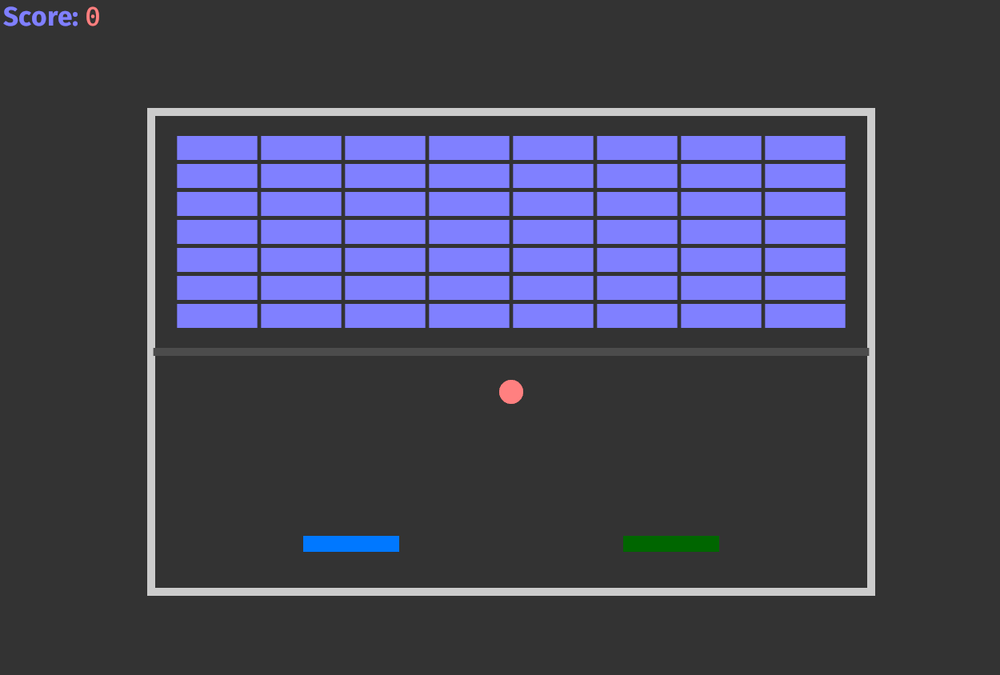

# Bifrost
This ECS game of "Breakout" serves to explore the efficacy of rollback P2P sessions via in a WebRTC context.



## Setup
1. Update to Rust `1.25.1+`.
``` 
rustup update
```
2. Navigate to project root and install WASM toolchain:
```
rustup target install wasm32-unknown-unknown
```
3. Build WASM target:
```
cargo build --target wasm32-unknown-unknown
```
4. Install WebRTC server `matchbox_server`:
```
cargo install matchbox_server
```


## Run Game
1. Start WebRTC server for player to connect to:
```
matchbox_server
```
2. The matchbox server is configured to run locally. Launch two browsers, I suggest running Chrome with an incognito window. 
(If you want to connect elsewhere, just modify the connection vars in `netcode.rs`.) 
3. Launch the game:
```
cargo run --release
```
4. In each browser connect to game by navigating to `http://127.0.0.1:1334/`.
5. Once both browsers are connected, the game will automatically start.
6. Controls are the standard WASD and arrows.


## References
- [Bevy ECS](https://docs.rs/bevy/0.9.1/bevy/index.html)
- [Bevy GGRS](https://github.com/gschup/bevy_ggrs)
- [Matchbox](https://johanhelsing.studio/posts/introducing-matchbox)
- [Learn ECS](https://gist.github.com/LearnCocos2D/77f0ced228292676689f)
- [RustConf 2018 GameDev](https://www.youtube.com/watch?v=aKLntZcp27M)
- [GGPO Rollback](https://www.ggpo.net/)