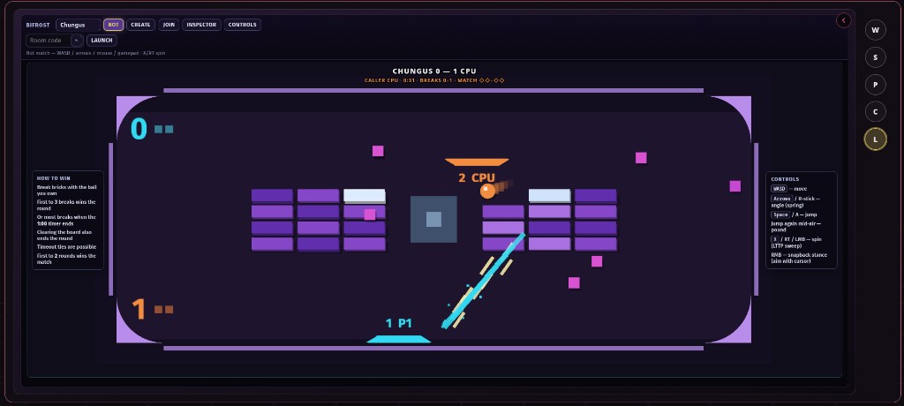
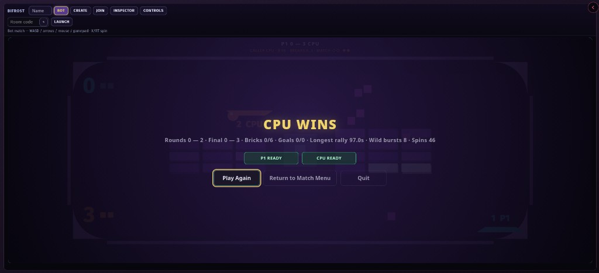
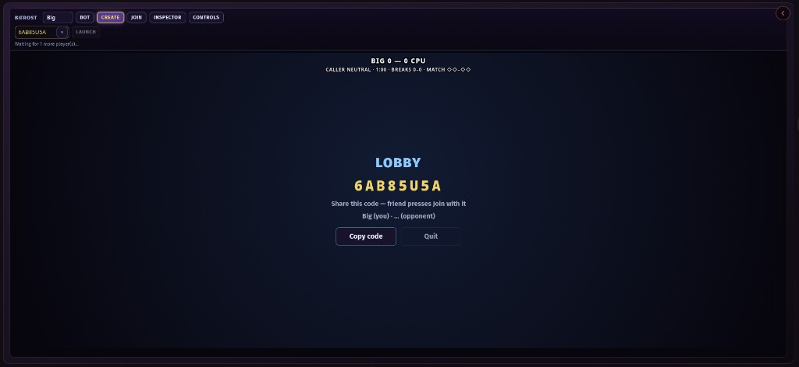
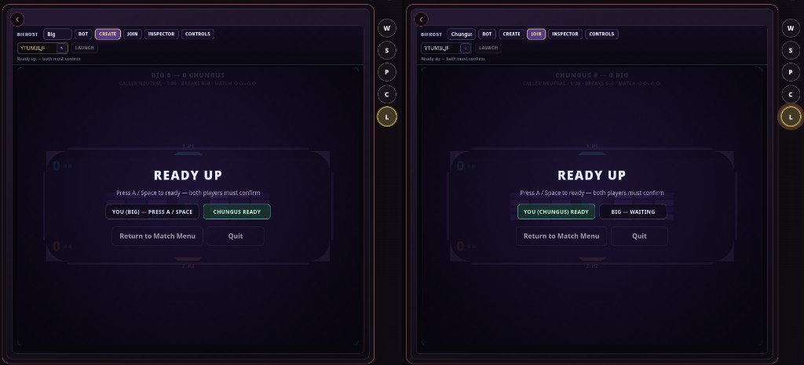
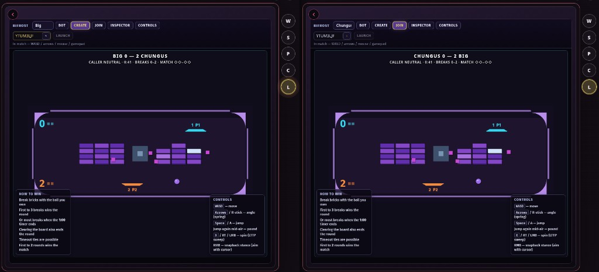

# Bifrost

Bifrost is a compact competitive Breakout/Pong arena used to demonstrate **GGRS rollback** over **WebRTC** in the browser. The simulation is deterministic and Bevy-free at the core; rendering and networking wrap the same `WorldState` snapshot used for rollback.

## Screenshots



*In match: Snapback force-wave, paddles, bricks, and Lab HUD.*



*Post-match results: scores, ready seats, Play Again / Match Menu / Quit.*



*Host lobby: share the room code while waiting for a join.*



*Ready Up (host + client): both seats must confirm before the match starts.*



*Online match: host and client views side by side.*

## What you can try

- **Play bot**: instant local match, Ready Up, then serve
- **Private rooms**: Create / Join with ephemeral codes; Launch once then grey until Quit
- **Leave / disconnect**: confirm before leave; host close or guest leave toasts; mid-match peer drop returns to Match Menu; refresh closes the lobby
- **Snapback**: wind paddle (±180°) with arrows / R-stick / RMB; aim with move stick or cursor while winding; release fires a force-wave opposite the stick/cursor release direction (toward the deadzone)
- **Spin**: hold X / LMB / RT; release for LTTP sweep (clangs with opposing attacks)
- **Jump / pound**: Space / A; jump again in air for ground-pound AoE
- **Rollback inspector**: RTT, input delay, rollback depth, checksum
- **Replay codes**: deterministic input tapes shareable without server storage

## Controls (Lab defaults)

| Action | Keyboard | Mouse | Pad |
|--------|----------|-------|-----|
| Move | WASD | Cursor chase (stops under pointer) | Left stick / D-pad |
| Angle / Snapback stance | Arrows | Hold RMB (aim at cursor) | Right stick |
| Jump / Ready | Space | (none) | A (South) |
| Ground pound | Jump again airborne | (none) | A again |
| Spin | Hold X | Hold LMB | West / RT |

Snapback beam fires **opposite** the latched move/aim direction (stick returning to center / deadzone). Wind range is ±180°; there is no 120° aim cone. Mouse chase uses visual paddle pose (`MouseAimAnchor`) and an unshaken camera for cursor→world. Mid-match hard disconnects only on GGRS `Disconnected` (not transient `NetworkInterrupted`). Page refresh / tab close leaves the room via `sendBeacon` (with sessionStorage reclaim on next load).

## Stack (pinned)

| Crate | Version | Notes |
|-------|---------|-------|
| Bevy | 0.18.1 | WebGL2 WASM client |
| bevy_ggrs | 0.20 | Rollback schedule |
| Matchbox | 0.14 | WebRTC signaling transport |
| Rust | 1.90 | MSRV for Bevy 0.18 deps |

Bevy 0.19 is deferred until Matchbox’s GGRS stack publishes a compatible release train.

## Quick start (native)

```bash
rustup toolchain install 1.90.0
cargo run -p bifrost_client -- --bot
# Enter → bot match · WASD / arrows · R restart
```

## Signaling service

```bash
cargo run -p bifrost_signal
curl -s localhost:8787/healthz | jq
curl -s -X POST localhost:8787/api/rooms -H 'content-type: application/json' -d '{"protocol_version":1}'
```

## WASM / web shell

```bash
cargo install trunk
trunk serve --open
# http://127.0.0.1:1334/
```

Local Docker: `deploy/docker-compose.local.yml` (Caddy publishes `:1334`).

## Tests

```bash
cargo test -p bifrost_sim
cargo fmt --all -- --check
cargo clippy -p bifrost_sim -p bifrost_signal -- -D warnings
```

## Deploy

See [docs/deployment.md](docs/deployment.md). Production is a small Compose stack (`signal` + `web` + Caddy); set `BIFROST_HOST` / `PUBLIC_ORIGIN` in `deploy/.env`.

## Docs

- [Architecture](docs/architecture.md)
- [Rollback model](docs/rollback.md)
- [Room protocol](docs/protocol.md)
- [Privacy & security](docs/privacy-security.md)
- [Contributing](CONTRIBUTING.md)

## License

Licensed under [GPL-3.0-or-later](LICENSE) (GNU General Public License v3.0 or later).
The bundled Fira Mono font remains under its [SIL Open Font License](assets/fonts/FiraMono-LICENSE.md).
